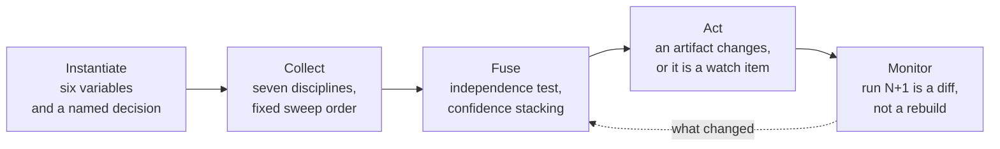

# Market Intelligence Skills

**Competitive research run as collection disciplines, not as a term paper.**

Twenty-two skills for Product Managers, Product Marketers, and Business Analysts who have to be right in public — with a source URL, a date, and a confidence rating behind every claim.

[](LICENSE)

## The Premise

The intelligence community solved this problem decades ago. They do not collect "data." They run **collection disciplines**, each with its own sources, tradecraft, and blind spots, then fuse them with a confidence rule that separates what can be acted on from what was merely noticed.

Product teams should steal the whole playbook.

Eight disciplines in total: **seven collection disciplines** — OSINT, FININT, GEOINT/DEMOINT, TECHINT, HUMINT, SIGINT, MASINT — plus **all-source fusion**, which produces no signals of its own and exists to combine the other seven.

The motion: **instantiate → search plan → collect → fuse → act → schedule the next diff.**



You can enter at any stage. This is a network, not a chain: a competitor surfacing in a lost deal starts at collection, a spreadsheet full of findings starts at fusion, a stale battle card starts at the act layer.

## Start Here

**New to a company that suddenly matters?** `mintel:mi-sweep-full-spectrum` — all seven disciplines in one sitting, fused, ending in a brief you can speak from memory.

**Not sure which run you need?** `mintel:mi-router-market-intelligence` — fills the six variables, refuses to proceed without a decision, and routes you.

**Evidence already in hand?** `mintel:mi-fuse-all-source` — the situation room.

## The Library

### Instantiate

| Skill | What it does |
|---|---|
| [`mi-router-market-intelligence`](skills/mi-router-market-intelligence/) | Scope the engagement on six variables and route it. Stops if you cannot name the decision. |

### Collect

Seven disciplines, plus four investigations that use them.

| Skill | Discipline | What it reads |
|---|---|---|
| [`mi-collect-osint`](skills/mi-collect-osint/) | OSINT | Press, analysts, exec social, reviews, events, prediction markets |
| [`mi-collect-finint`](skills/mi-collect-finint/) | FININT | Filings, Risk Factors diffs, earnings dodges, procurement, registrations |
| [`mi-collect-geoint-demoint`](skills/mi-collect-geoint-demoint/) | GEOINT/DEMOINT | Establishment counts, occupations, wages, firmographics, trade flows |
| [`mi-collect-techint`](skills/mi-collect-techint/) | TECHINT | Patents, trademarks, changelogs, API diffs, repos, standards, preprints |
| [`mi-collect-humint`](skills/mi-collect-humint/) | HUMINT | Hiring surges, leadership moves, departures, sentiment, win/loss framing |
| [`mi-collect-sigint`](skills/mi-collect-sigint/) | SIGINT | Pricing diffs, messaging diffs, certificates, app metadata, search terms |
| [`mi-collect-masint`](skills/mi-collect-masint/) | MASINT | Supply chain, facilities, permits, certifications, ops capacity, scale proxies |
| [`mi-sweep-full-spectrum`](skills/mi-sweep-full-spectrum/) | All seven | One company, one sitting, fused, call-ready brief |
| [`mi-scan-market-landscape`](skills/mi-scan-market-landscape/) | OSINT | Segments as buyers see them, players including non-consumption, whitespace |
| [`mi-snapshot-competitors`](skills/mi-snapshot-competitors/) | OSINT | Up to three profiles, a buyer-dimension matrix, a counted so-what |
| [`mi-mine-voice-of-customer`](skills/mi-mine-voice-of-customer/) | OSINT | Need themes, competitor weak points, and switching triggers |

### Fuse

| Skill | What it does |
|---|---|
| [`mi-fuse-all-source`](skills/mi-fuse-all-source/) | Independence test, confidence stacking, commitment check, artifact-mapped responses |

### Act

Frameworks that **consume** fused evidence. They do not manufacture it.

| Skill | The question it answers |
|---|---|
| [`mi-analyze-swot`](skills/mi-analyze-swot/) | Where do we stand? |
| [`mi-analyze-five-forces`](skills/mi-analyze-five-forces/) | Is this industry worth being in? |
| [`mi-analyze-ansoff`](skills/mi-analyze-ansoff/) | Where do we grow next? |
| [`mi-size-tam-sam-som`](skills/mi-size-tam-sam-som/) | How big is this, and can we defend the number? |
| [`mi-build-battle-card`](skills/mi-build-battle-card/) | What does the field say tomorrow? |

### Monitor

The diff layer. Built to run on a schedule without a human answering questions.

| Skill | Cadence | What it diffs |
|---|---|---|
| [`mi-watch-competitors`](skills/mi-watch-competitors/) | Weekly / monthly | Material shifts across a watchlist |
| [`mi-monitor-pricing-packaging`](skills/mi-monitor-pricing-packaging/) | Weekly | Tiers, prices, units, limits — captured verbatim |
| [`mi-monitor-pestel-delta`](skills/mi-monitor-pestel-delta/) | Quarterly | Macro factors, and which artifact now rests on something untrue |
| [`mi-refresh-earnings-signals`](skills/mi-refresh-earnings-signals/) | Quarterly | Strategy language, dropped phrases, new deflections |

## The Contract Every Run Honors

- **Question budget.** Hard cap of three, then proceed on labeled assumptions. Four for sizing. Never ask for a fact that is publicly discoverable — that is burden-shifting.
- **Search plan gate.** Three bullets before researching: sweep order, date window, noise filter. Four for a full sweep, identity first. Continues unless revised.
- **Evidence labels.** Every key line marked **Fact**, **Inference** (chain shown), or **Assumption** (basis stated).
- **Real, checkable URLs with dates**, plus a per-run do-not-invent list naming that domain's specific fabrication risks.
- **Gaps are findings.** A discipline that returns nothing gets one honest line, never padding.
- **Stable output schema**, so run N and run N+1 are diffable — which is what makes scheduled re-runs worth scheduling.
- **Final Step block.** Exactly four numbered options, the recommended one first.

## The Core Rule

```text
1 discipline flags it  -> Watch item. Log it, do nothing.
2 disciplines agree    -> Working hypothesis. Assign someone to probe.
3+ disciplines agree   -> Actionable intelligence. Brief leadership, move.
Disciplines conflict   -> The most interesting case. Someone is bluffing. Dig.
```

**Independence test first.** Two signals citing the same underlying source — a press release and its coverage — count as **one** discipline. "Six sources" that collapse to two disciplines is the single most common way a competitive deck lies by accident.

**Ambition versus commitment.** Treat announcements as intent until funding, procurement, land, permits, hiring, or contracts corroborate them. Ambition is OSINT. Commitment shows up in FININT, MASINT, and HUMINT.

## The Reference Shelf

The doctrine behind the skills lives in [`reference/`](reference/):

- [`disciplines.md`](reference/disciplines.md) — the eight disciplines: sources free and paid, signal-to-inference chains, artifacts fed, strongest fusion pairs
- [`sweep-playbooks.md`](reference/sweep-playbooks.md) — how to run each sweep: order, do-not-invent list, handoffs, gap language
- [`fusion.md`](reference/fusion.md) — independence test, confidence stacking, commitment ladder, conflict digs
- [`frameworks.md`](reference/frameworks.md) — the act layer's discipline rules
- [`monitors.md`](reference/monitors.md) — materiality bar, changelog format, update flags, the fusion cadence
- [`regional-overlays.md`](reference/regional-overlays.md) — EU and MENA source overlays, and the pattern for building a new one
- [`output-schemas.md`](reference/output-schemas.md) — the stable schemas that make run N+1 a diff
- [`guided-context-capture.md`](reference/guided-context-capture.md) — the interaction contract every skill honors

The [`prompts/`](prompts/) directory carries the twenty-one original runnable prompts this Project was distilled from, for use in tools where a skill cannot be installed.

## Guardrails

All of this is legal, ethical, open-source collection.

- **Yes:** anything published, filed, posted, or observable in public.
- **No:** pretexting, soliciting NDA-protected information, engaging someone to extract a former employer's secrets, scraping in violation of terms you agreed to.

Rule of thumb: **if you would be uncomfortable explaining your method on stage at their user conference, do not use the method.** The [SCIP Code of Ethics](https://www.scip.org/page/CodeofEthics) is the industry reference.

## A Note on the Examples

Every worked and weak example in this Project is **synthetic**. All companies, figures, quotes, filings, prices, and URLs are invented for teaching. Nothing in `skills/*/examples/` is a claim about a real organization. See [NOTICE.md](NOTICE.md).

## Install

```bash
/plugin marketplace add Productside/Productside-Market-Intelligence-Skills
/plugin install mintel
```

Skills then appear as `mintel:mi-collect-osint`, `mintel:mi-fuse-all-source`, and so on.

## For Contributors

- [`QUICKSTART.md`](QUICKSTART.md) — first run, in five minutes
- [`docs/SKILL-SPEC.md`](docs/SKILL-SPEC.md) — the authoring and behavioral source of truth
- [`CONTRIBUTING.md`](CONTRIBUTING.md) — the contribution test, and what never enters this Project
- [`CONSTITUTION.md`](CONSTITUTION.md) — the non-negotiable rules that override everything else
- [`catalog/INDEX.md`](catalog/INDEX.md) — every skill with its stage, discipline, and triggers

```bash
./scripts/test-library.sh
```

## About These Materials

Productside is a product management training and advisory firm, not a software company. The materials in this Project are digital takeaways and examples that demonstrate and extend Productside's teaching and advisory services: classes, workshops, webinars, consulting, advisory engagements, and lead generation. They take the form of prompts, skills, templates, worksheets, and reference examples. They are the same kind of leave-behind a learner or workshop participant receives as a handout or workbook, served in the format the tools actually use. They are provided as is, as instructional material, and not as a software product or service.

## License

[CC BY-NC-SA 4.0](LICENSE). Copyright 2026 280 Group LLC dba Productside. Commercial use requires express written permission.
