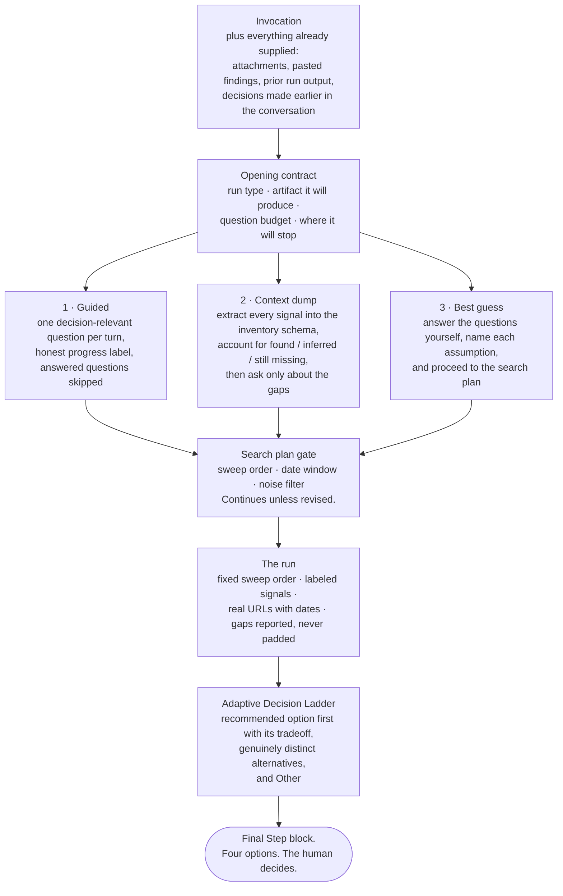

# Guided Context Capture

The shared interaction contract for every skill in this library. It adapts the three-mode progressive context pattern used across Productside's skill libraries to the evidence, provenance, and scheduling requirements of intelligence work.

## Why It Exists

A Product Manager should not need a perfect brief before receiving useful help. They also should not be forced through a questionnaire when they already supplied the answer in a document, an upstream artifact, or the invocation itself.

There is a second reason here that does not apply to a purely facilitative library. **These runs must survive silence.** A competitive watch that fires on a schedule has nobody to answer its questions at 6am on a Tuesday. Three properties make that safe, and all three live in this contract:

1. The question budget caps at three and then proceeds on labeled assumptions.
2. The search plan gate continues unless revised. Nobody has to approve anything.
3. The output schema is stable, so run N+1 diffs against stored output rather than needing context re-supplied.

A skill that blocks waiting for input cannot be scheduled, and scheduling is where this work compounds.

## The Shape of the Contract



All three modes converge on the same search plan gate and the same Final Step block. The mode changes how context is gathered; it never changes what the user is shown before deciding, and it never changes where the run stops.

## Opening Contract

Every skill begins with a short heads-up that names:

- the run being performed and the discipline or stage it belongs to
- the artifact it will produce
- the question budget and approximate time
- where the run will stop

Then offer:

1. **Guided** — Ask one question at a time, with progress shown.
2. **Context dump** — Accept findings, links, prior runs, or pasted material; extract what is already answered and ask only about material gaps.
3. **Best guess** — Answer the setup questions yourself, name each assumption, and proceed.

Accept `1`, `2`, `3`, the mode name, or a natural-language equivalent.

**Two standing bypasses at every turn.** At any point the user may say "take your best guess" (answer the pending question yourself and name the assumption) or paste a bulk drop (extract it, account for it, ask only about gaps). Neither requires returning to the opening menu.

**On silence, proceed.** If the session already holds enough context, say "I have what I need" and go straight to the search plan. If nobody answers at all, use the skill's stated defaults, label them, and run.

## Capability Check

State in one line whether you have web access.

- **Web access:** research live, cite URLs with dates.
- **No web access:** say so plainly, run from training data, mark every finding as an Assumption with its knowledge vintage, and invent nothing.

A fabricated citation is worse than an admitted gap, and in a briefing it is worse still, because the user will repeat it out loud.

## Context Already Supplied

Treat all of the following as answers already given:

- text included with the invocation
- attached or linked files the agent can inspect
- pasted findings, notes, or research
- output from an earlier run in this series, or from another skill in this library
- decisions recorded earlier in the conversation

Do not ask the user to repeat any of it. Begin at the first material gap and keep progress labels honest.

**Never ask for a fact that is publicly discoverable.** Asking a Product Manager for a competitor's headcount, funding history, or pricing tiers is burden-shifting: it is the exact work the run exists to perform. Ask only for knowledge, judgment, risk acceptance, or authority the human uniquely holds — which decision this feeds, which competitors show up in lost deals, what the field is already claiming.

## The Question Budget

Hard cap of three questions, then proceed on labeled assumptions. Sizing runs get four, because the constraint set is wider.

In Guided mode:

1. Ask one decision-relevant question per turn.
2. Explain why the answer changes the artifact when that is not obvious.
3. Offer three concise context-aware options plus `Other (specify)`.
4. Accept multi-select answers such as `1,3`, `1 and 3`, or a custom response.
5. Show progress as `Setup Qx/3` or the more specific label the skill defines.
6. Ask a follow-up only when the unresolved point could materially change the output.

Do not bundle three questions beneath one heading and call it one turn.

## The Search Plan Gate

Before researching, show a three-bullet plan:

- **Sweep order** — which sources, in what sequence
- **Date window** — the period in scope; "recently" is not a window
- **Noise filter** — how you will avoid same-name companies, acquisitions that closed years ago, and press releases recycled by aggregators into what looks like three sources

Make it **four bullets for a full-spectrum sweep, identity first**: legal entity, tickers, major subsidiaries and brands. Catching the wrong company at the gate costs one line; catching it in section eight costs the whole run.

Then continue unless revised. Do not wait for approval that may never come.

## Mode-Specific Behavior

### Guided

- Ask the skill's setup questions in sequence, within the budget.
- Skip any question already answered.
- Show the search plan before collecting.

### Context Dump

- Invite the user to provide whatever exists, in whatever condition.
- Extract every signal into the inventory schema in `output-schemas.md`.
- Account for it visibly: **found in the paste / inferred from the paste / still missing**.
- Tag pasted signals with their provenance. A signal whose source you cannot check is an Assumption, no matter how confidently it was pasted.
- Ask only about the gaps, within the question budget.

### Best Guess

- Answer the setup questions yourself and name each assumption where it appears.
- Use the skill's stated defaults for depth, framing, and audience.
- End with `Assumptions to Validate`, ranked by how much each would change the output if wrong.
- Never invent citations, figures, quotes, customer names, or URLs. The bypass covers context, not evidence.

## Adaptive Decision Ladder

At a meaningful decision gate, present a context-adaptive numbered ladder:

1. Put the recommended option first and label it `(Recommended)`.
2. Explain the tradeoff or consequence of every option in one sentence.
3. Include two or three genuinely distinct choices, not cosmetic rewrites.
4. Permit combining options when the decision allows it.
5. Include `Other (specify)` when the listed choices cannot reasonably be exhaustive.

Recommendations must follow the evidence. They are not substitutes for the human decision.

## The Final Step Block

Every run ends with exactly four numbered options, the recommended one first and marked, then the reply invitation:

```text
## Final Step

1. [Most likely next move] (Recommended)
2. [Turn this into the downstream artifact]
3. [Set up the recurring version so the next run is a diff]
4. [Reformat or repackage for a different audience]

Reply with `1`, `2`, `3`, `4`, `1 and 3`, `Verbose Mode`, or a custom path.
```

Four is the cap. Two options is a false binary; six is a menu nobody reads. Option 3 should almost always be the scheduling move, because the compounding value of this work lives in the series, not in any single run.

## Interruptions and Resume

- Answer meta questions directly, then restate progress and the pending question.
- Stop immediately when the user asks to pause or stop.
- On resume, summarize captured context, unresolved gaps, and the next question.
- If the user requests a single-shot output, use the fast path: draft the artifact, label gaps, and preserve the Final Step block.

## Just Enough Mode

The default. Strongest findings, short bullets, capped counts. Verbose only on request, and the Final Step block always offers it.

The temptation in intelligence work is volume, because volume looks like effort. It is the opposite: a brief that reports everything found has not done the ranking that makes it useful. Cap inference chains at five, fusion stories at five (seven in a full-spectrum sweep), and player maps at twelve.

## Completion

Before the Final Step block, show:

- what was supplied and what was collected
- what was inferred, with the chain visible
- what remains unknown, disputed, or uncollected
- whether the artifact is ready for the decision it was run for

The run ends at its Final Step block. It does not silently invoke the next skill.
